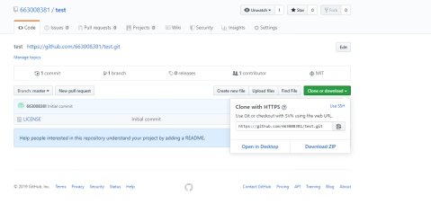

# 实验一  **购买腾讯云服务器并登录**

## 一.**购买腾讯云服务器并登录**

### 1.购买腾讯云服务器

### 2.使用Web Shell登录已购买的云服务器实例

### 3.下载安装Xshell（包含在Xmanager中），并使用 Xshell登录腾讯云实例 

将复制的公网地址输入Xshell中，并登陆

## 二.Github使用入门

### 1.初始化本地文件夹作为一个Git仓库：

`git init`

 

### **2.拷贝GitHub网站中的项目网址：**

### 3.**添加远程代码仓库的URL：**

`(git remote add origin https://github.com/663008381/test.git)`

`git remote add origin https://github.com/663008381/cloud-computing.git`

说明，origin指代远程代码仓库（GitHub中），master表示本地的主分支。验证一下添加是否成功：

`git remote -v`

### 4.**首先从远程代码仓库拉取数据**

`git pull origin master`

### 5.**新建README文档，README文档是每个GitHub项目必备，说明项目内容。上文没有创建，在此处完成。**

`touch README.md`

### 6.**添加文件夹中的所有文件：**

`git add .`

### 7.**提交文件：**

`git commit -m “wuue”   //上传者名字`

可以使用`git config user.name "someone"`，`git config user.email "someone@someplace.com"`修改上传者信息

### 8.**推送本地更新至远程服务器：**

 

`git push -u origin master`

 

# 