# 实验三 Docker基础实验

### 1.安装Docker

首先更新应用程序数据库：

`yum check-update`

接下来添加Docker的官方仓库，下载最新的Docker并安装：

`curl -fsSL https://get.docker.com/ | sh`

安装完成之后启动Docker守护进程，即Docker服务：

`sudo systemctl start docker`

验证Docker是否成功启动：

`sudo systemctl status docker`

得到类似如下图的输出：

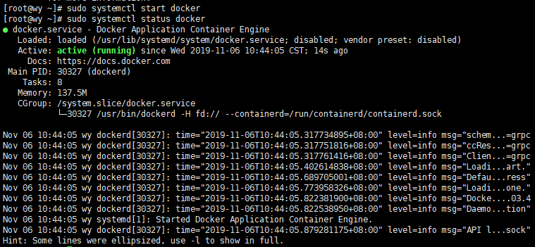

最后，确保Docker当服务器启动时自启动：

`sudo systemctl enable docker`

### 2.完成Docker安装之后加载CentOS镜像

查看docker所有的命令，键入：

`docker`

查看当前系统docker的相关信息：

`docker info`

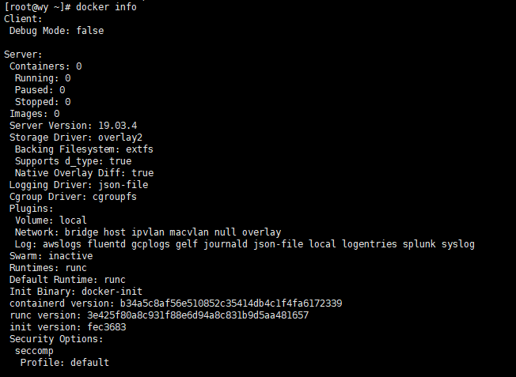

可见当前并未安装任何镜像（Images），运行任何容器（Containers）。

##### 加载Docker镜像

拉取官方版本(OFFICIAL)的镜像：

`docker pull centos:7`

一旦镜像下载完成，可以基于该镜像运行容器，使用run命令：

`docker run centos:7`

查看一下当前系统中存在的镜像：

`docker images`

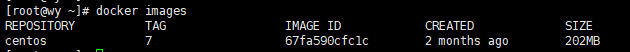

##### 运行Docker容器

以上述的CentOS镜像为例运行其容器，使用-it参数进入交互shell模式：

`docker run -it centos:7`

进行container内部shell，如下图所示：

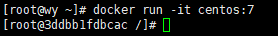

其中3ddbb1fdbcac是容器的ID，后续要用到。你可以在此shell运行任何命令，比如安装Apache Web服务器：

`yum install httpd`

现在此容器已经安装了Apache Web服务器。***注意：所有对于容器的更改只保存在当前运行的容器中，并未写入镜像。***

##### 创建新的镜像

在前序操作的基础上，本小节将创建新的镜像，即提交更改到新的镜像。首先从容器的交互shell退出并保存状态，使用exit命令

`exit`

我们首先使用如下命令查看本地中的容器：

`docker ps -a`

参数-a表示列出所有容器，包含活跃的和不活跃的。输出类似下图：

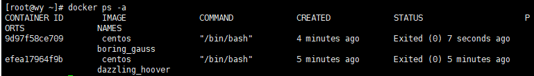

现在使用commit命令来提交更改到新的镜像中，即创建新的镜像。命令格式

`docker commit [OPTIONS] CONTAINER [REPOSITORY[:TAG]]`

例如：

`docker commit -m "install apache server" -a "wy" e442959d13ac centos:apache_web`

这种提交类似于git协议的提交，同样这里提交的镜像只保存在本地。后续可以提交到远程镜像仓库，比如Docker Hub。
再次使用镜像查看命令：

`docker images`

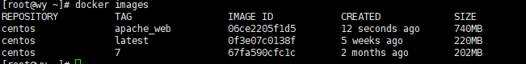

接下来要为新建的镜像打上标签（Tag），否则后续推送镜像到Docker Hub的时候将出现“ denied: requested access to the resource is denied”的错误。

Tag命令的语法：

`docker tag SOURCE_IMAGE[:TAG] TARGET_IMAGE[:TAG]`

进一步细化到推送至Docker Hub的镜像，使用如下格式：

`docker tag SOURCE_IMAGE[:TAG] docker-hub-username/REPOSITORY[:TAG]`

其中hub-username是Docker Hub的用户账户，这里采用如下命令：

`docker tag 06ce2205f1d5 centos:v1`

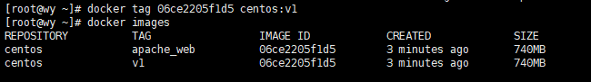

运行Docker容器（为了方便检测后续wordpress搭建是否成功，需设置端口映射（-p），将容器端口80 映射到主机端口8888，Apache和MySQL需要 systemctl 管理服务启动，需要加上参数 –privileged 来增加权，并且不能使用默认的bash，换成 init，否则会提示 Failed to get D-Bus connection: Operation not permitted ，-name 容器名 ，命令如下 ）

`docker run -d -it --privileged --name wordpress -p 8888:80 -d centos:7 /usr/sbin/init`

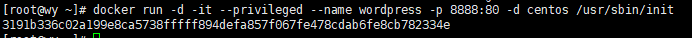

进入容器前台（容器id可以只写前几位，如 ：f188）

docker exec -it f188 /bin/bash

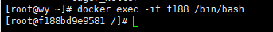

### 3.容器中安装wordpress

参考  [实验二 腾讯云CentOS 7上搭建WordPress](https://github.com/663008381/cloud-computing/tree/master/test2)

### 4.推送带有wordpress的镜像

首先去注册[Docker Hub](https://hub.docker.com/)

然后这里我们使用shell登录：

`docker login -u docker-hub-username`

输入密码。用户名和密码都正确，随后会显示登录成功。

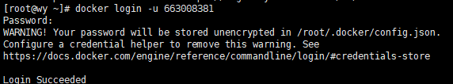

使用如下命令推送新创建的镜像：

`docker push docker-hub-username/docker-image-name`

docker-hub-username替换为实际的用户名，镜像名这里使用REPOSITORY:TAG的组合。这将花费一定的时间，完成之后登陆Docker Hub，查看Repository，可以看到新上传的镜像。

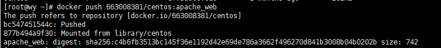

登录Docker网页查看仓库

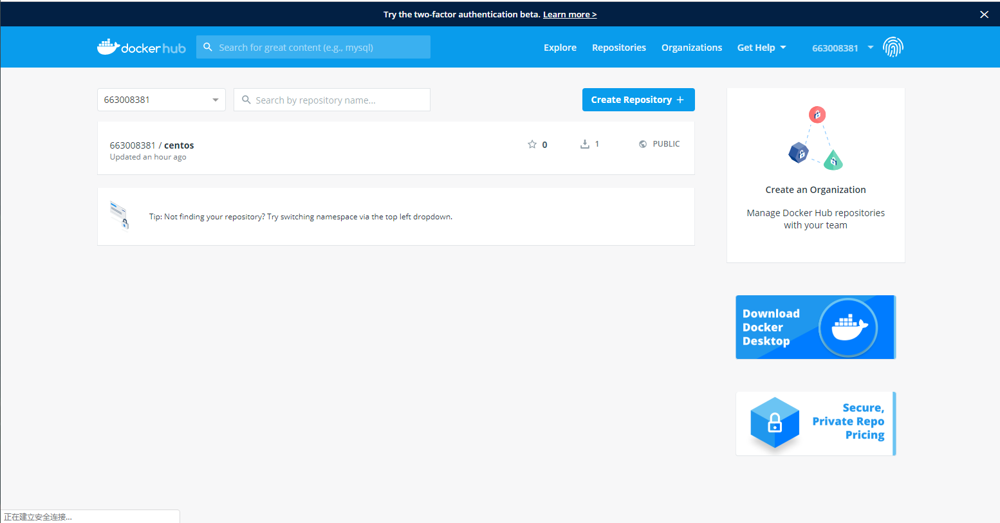